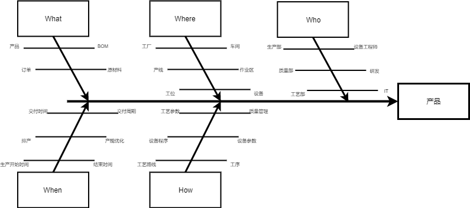
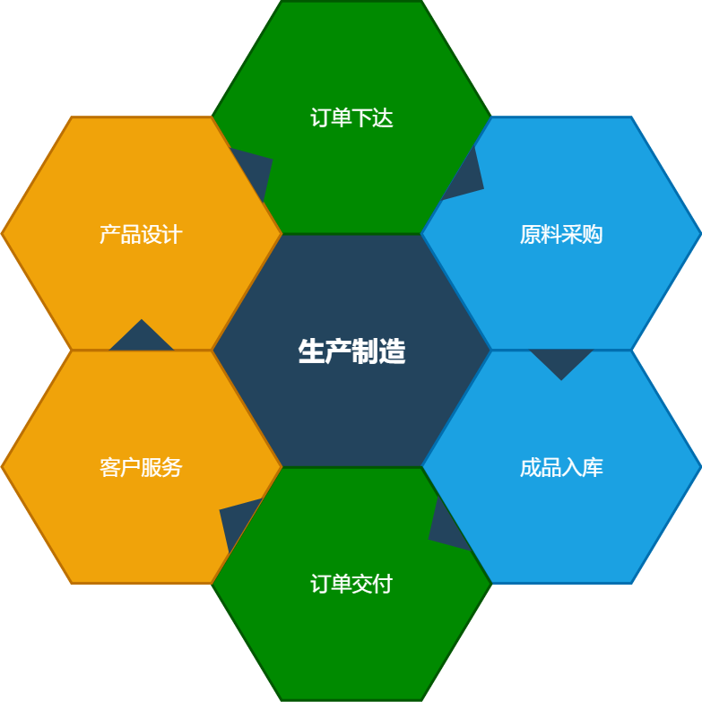
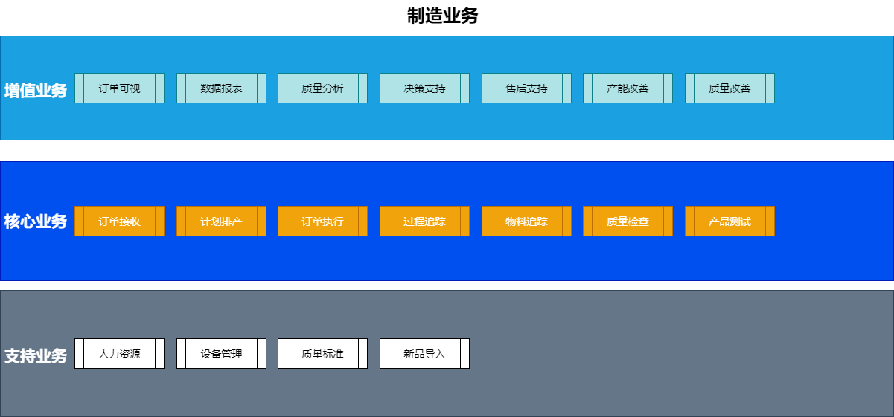

# 什么是制造

自从工业革命以来，制造就成为支撑人类社会活动的主要内容之一。当代人类社会的所有生产生活必须的实物几乎都来自制造业，根据个人的理解：

```
    制造是将原材料根据一定的方法，变成成品的过程。目前的人类社会，基本上是制造出来的。
```

[[TOC]]

## 制造行业的分类

根据MES/MOM系统领域的分类方法，制造行业被分成过程(流程)制造业和离散制造业。通常:

```
    流程制造顾名思义就是在生产过程中不能中断，生产是连续或者批量进行的，例如化工、钢铁、造纸等。
```

```
    离散制造就是生产过程可以中断，例如机械加工、3C 电子加工等。
```

还有一类行业叫做混合制造业

```
    例如食品饮料，他的前端工序可能是连续式生产，后端包装就属于离散式生产。
```

西门子中国在知乎提供了一个链接，详细地用中文解释了基本概念:
[流程制造与离散制造](https://www.zhihu.com/question/31628698)

笔者对于离散制造业比较熟悉，因此后续的内容主要讲述离散制造业的相关内容。

## 制造业务的范围

下图描述了制造业务的范围：



笔者尝试用5W1H的分析方法来展示整个制造流程的概念，因为不理解Why，所以变成了4W1H。

1. What - 把什么原材料变成什么样的成品
    1. 产品 - 要生产什么东西？
    2. BOM - 产品的组成
    3. 订单 - 生产多少数量，日常的制造信息的主要来源
    4. 原材料 - 生产的原料

2. When - 什么时候生产
    1. 生产开始和结束时间 - 通常有预计和实际2个值
    2. 排产 - 排产通常也叫计划，指的是将待生产的订单排好顺序以准备生产的过程
    3. 产能优化 - 对于制造资源的充分利用
    4. 交付时间 - 将产品交付给下一环节的时间
    5. 交付周期 - 从下单到完成经历的周期

3. Where - 在哪生产
    1. 工厂
    2. 车间
    3. 产线 - 流水线式生产
    4. 作业区 - 作业区域式生产
    5. 工位 - 产线或者作业区内的具体位置
    6. 设备 - 需要的工具或者机器

4. Who - 由谁生产
    1. 生产部 - 也叫制造部，生产制造的主力。
    2. 设备工程师 - 当自动化程度较高时，设备工程师就成为生产制造的主力
    3. 质量部 - 生产部的(伪)对头，产品质量控制的主力和标准制定者
    4. 研发 - 产品的设计者，是不是能多快好省地制造，首先由他们决定
    5. 工艺部 - 制造流程的定义者，主导如何制造
    6. IT - 制造系统的设计和支持部门，必须存在的角色，但是日常存在感较低。

5. How - 如何生产，以下的因素通常由产品决定：
   1. 工序 - 产品必须经过的制造步骤
   2. 工艺路线 - 工序的顺序和集合
   3. 设备程序 - 设备需要运行的程序
   4. 设备参数 - 设备的配置参数
   5. 工艺参数 - 生产过程中需要控制的参数，通常不涉及大型设备，例如电动螺丝刀的扭矩
   6. 质量管理 - 如何管理质量

## 制造业务与供应链业务

下图展示了制造业务与供应链业务的关系:


既然本文主要讲制造，当然生产制造是宇宙中心。整个图代表供应链，通常橙色的部分不会被全部划分到供应链业务中，但是其中有一部分会被视为供应链业务。

## 制造业务的构成

下图展示了制造业务的构成:


上图中对于业务分类的划分，基于如下的原则:

1. 核心业务 - 这些业务流程用于将产品制造出来。
   1. [订单接收](./core/orderreceive.md)
   2. 计划排产
   3. 订单执行
   4. 过程追踪
   5. 物料追踪
   6. 质量检查
   7. 产品测试
   
2. 支持业务 - 这些业务流程用于对核心业务提供必要的支持。
   1. 人力资源
   2. 设备管理
   3. 质量标准
   4. 新品导入

3. 增值业务 - 这些业务实际上是制造业务对于"降低成本，提高利润"的要求。
   1. 订单可视
   2. 数据报表
   3. 质量分析
   4. 决策支持
   5. 售后支持
   6. 产能改善
   7. 质量改善

欢迎本文的读者对本节提出意见
